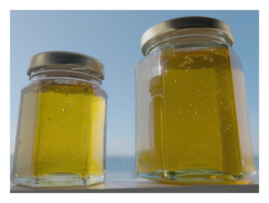
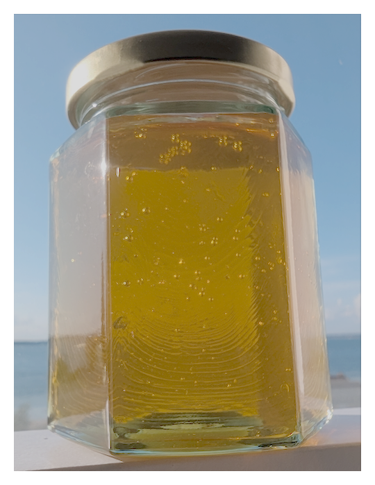
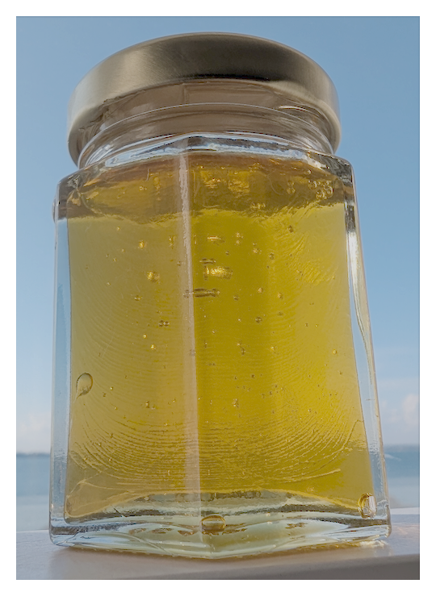

# Isle of Wight Honey

Organic Honey produced in Cowes on the Isle of Wight in the South of England.

We have two jar sizes:

## 250g Organic Honey

### &pound;8

Pay by PayPal: [https://paypal.me/iowhoney/8](https://paypal.me/iowhoney/8)

or scan the QR code:

](images/paypal_qr_iowhoney-8.png "250g https://paypal.me/iowhoney/8")

## 87g/2oz Organic Honey

### &pound;6

Pay by PayPal: [https://paypal.me/iowhoney/6](https://paypal.me/iowhoney/6)

or scan the QR code:

](images/paypal_qr_iowhoney-6.png "87g https://paypal.me/iowhoney/6")

Delivery by arrangement: [contact@iowhoney.com](mailto:contact@iowhoney.com)
